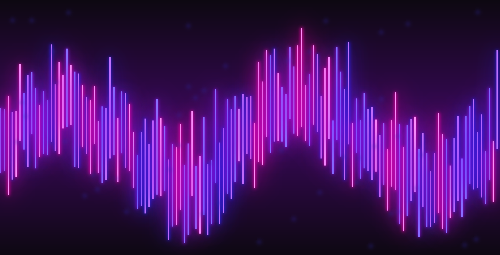

## Synthwave Background

# Overview

Synthwave Background is a simple web project that features a visually striking static background inspired by the synthwave aesthetic. The background consists of vibrant neon-colored bars against a dark backdrop, reminiscent of 80s retro-futuristic design. This project demonstrates basic web development techniques using HTML, CSS, and JavaScript.

# Contents

The project includes the following files:

    index.html: The main HTML file that serves as the entry point of the application.
    styles.css: The CSS file that contains styles for the HTML elements.
    script.js: The JavaScript file that adds interactivity to the web page.

# Getting Started

To view and interact with the project, follow these simple steps:

    Clone or Download the Project:
        Clone the repository using Git:
        
        git clone https://github.com/fromDiana/Synthwave-background.git
        
        Or download the ZIP file and extract it to your desired location.

    Open the HTML File:
        Navigate to the project directory.
        Open the index.html file in your preferred web browser.

# Project Structure

    web/
    │
    ├── index.html        # Main HTML file
    ├── styles.css        # CSS styles for the project
    ├── script.js         # JavaScript file for interactivity
    └── screenshot.png    # Screenshot of the project

# Usage

Simply open the index.html file in your web browser to view the synthwave background. The HTML file includes references to the CSS and JavaScript files, which are loaded automatically.

# Screenshot

# Contact

For any questions or suggestions, please contact [orsolyovadianka@gmail.com].
